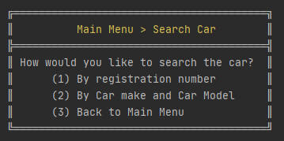
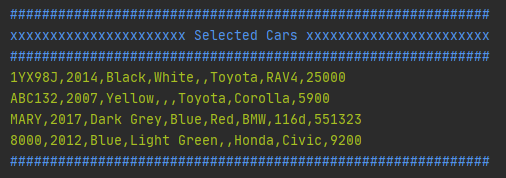
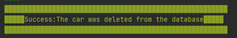
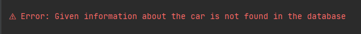
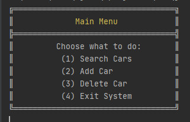

# Car Warehouse Database System

CWDBS is the 5th offline of CSE 108 and 2nd Java offline. 
This will pave the path towards JAVAgui programming with architecture and data flow design.

## Used Models

- MVC model
- Data Persistance
- Singleton Class
- CMD text formatting

## Data flow architecture

Load from database -> Save in singleton class -> Serve data from singleton -> Edit data in singleton -> Save data on close

## Features

#### Menu

#### Search

#### Result

## UI

#### Main Menu

