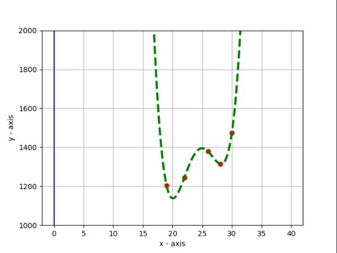
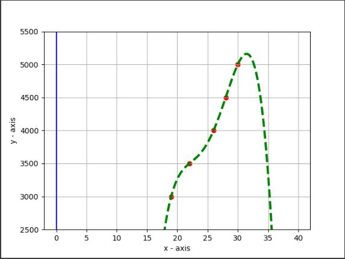
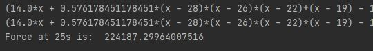

# Interpolation

## Newton's Divided Difference Interpolation

### Description

**Interpolation** is an estimation of a value within two known values in a sequence of values.

**Newton’s divided difference interpolation formula** is a interpolation technique used when the interval difference is not same for all sequence of values.

### Code

The code can be found [Here](Interpolation/Newton's Divided Difference Interpolation)

### Task for Online

Find the mass (in metric ton unit) and velocity (in m/sec unit) of Hardin-3 in t= 25sec using fourth order polynomials of Newton's divided difference method.

| t (sec) | m (metric ton) | v (m/sec) |
| ------- | -------------- | --------- |
| 0       | 1011           | 1000      |
| 5       | 1255           | 1500      |
| 9       | 1347           | 2000      |
| 12      | 1101           | 2500      |
| 19      | 1203           | 3000      |
| 22      | 1245           | 3500      |
| 26      | 1378           | 4000      |
| 28      | 1315           | 4500      |
| 30      | 1475           | 5000      |
| 33      | 1547           | 5500      |
| 40      | 1689           | 6000      |

As we need 4th order polynomial we select the data from 19 to 30 as they are the closest 5 points including the brackets.

#### Plotted Graph For Mass

#### Plotted Graph For Velocity

#### Differentiation

## Lagrange's Interpolation

### Description

### Code

The code can be found [Here](Interpolation/Lagrange's Interpolation)