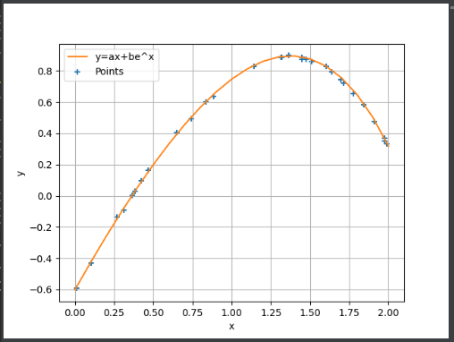

# Regression

**Regression** is a statistical method used in finance, investing, and other  disciplines that attempts to determine the strength and character of the relationship between one dependent variable (usually denoted by Y) and a series of other variables (known as independent variables).

Here, we will deal with 4 types of regression 

- Linear Regression
- Exponential Regression
- Polynomial Regression
- Mixture of 1 and 2 (In online)

### Assets

Last year offline

This years online

