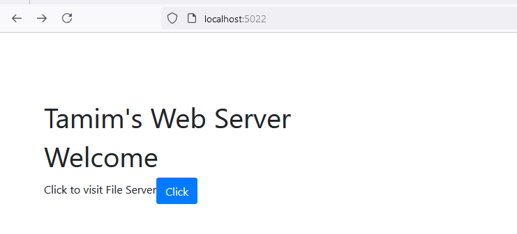
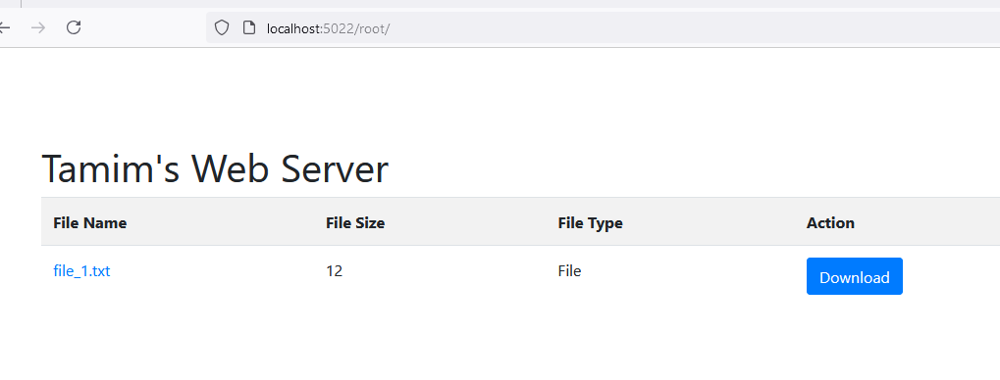

# HTTP File Server


## API endpoints
```bash
GET / # Home page
GET /root # file server
GET /root/file_name # file name
UPLOAD / # uploads a file to the server
```

## How to run locally
At first run the file server `HTTPServer/Server.java` using your favourite ide.
To access the get paths, open any browser and type the urls. You will be show the servers. 





To upload a file to the server, run the `Uploader.java` in FileUploader module. To upload any file, copy the path of the file and paste it in the console of the running file uploader program. The uploaded file will be in `/root/uploaded/` folder in the http server